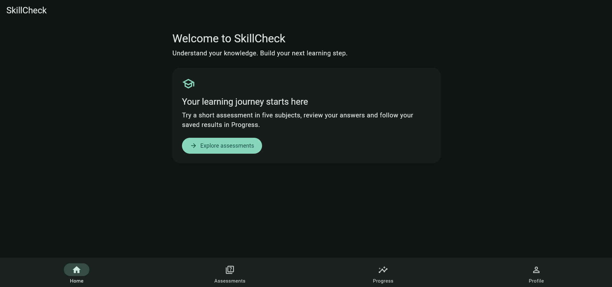
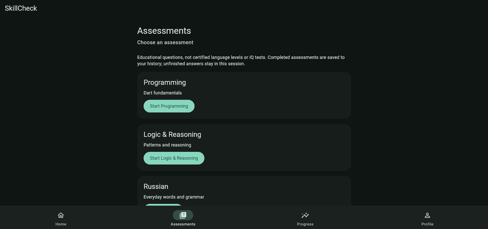
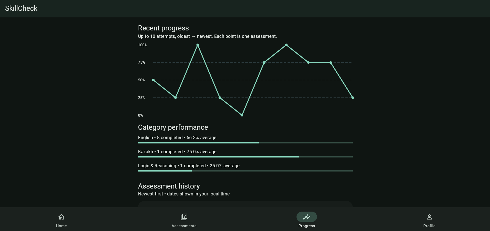
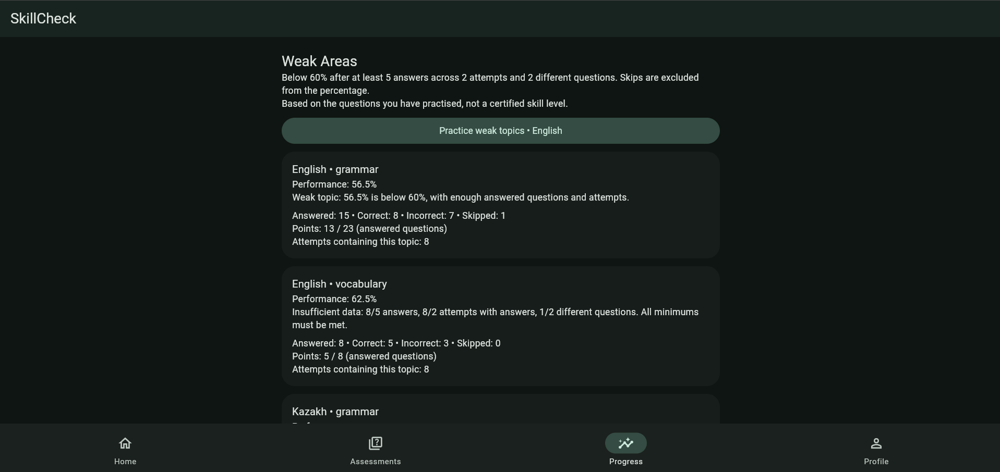
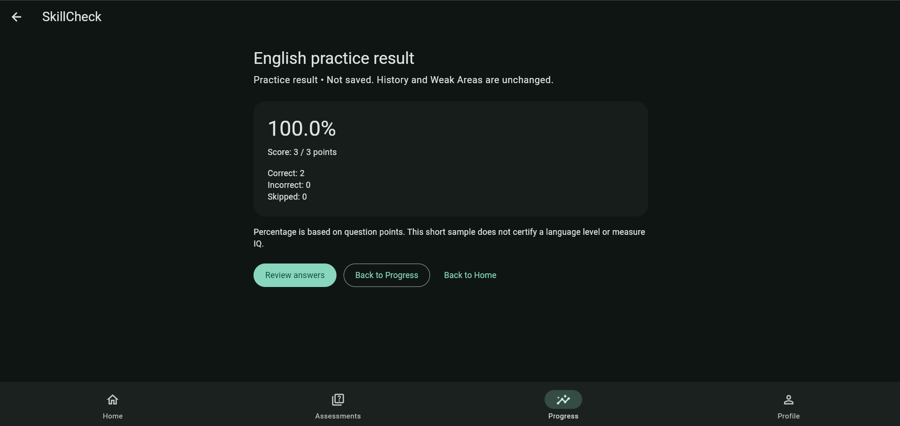
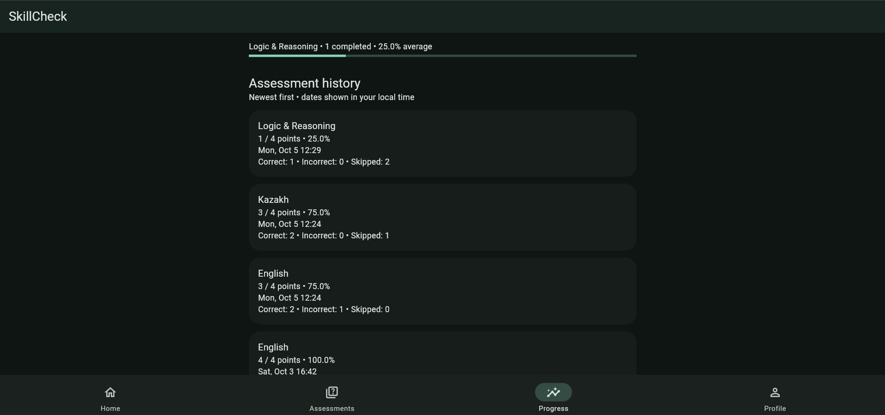

# SkillCheck

**Test your skills. Track your progress.**

A Flutter learning app for short assessments, saved progress and targeted weak-topic
practice. Built as a Software Engineering portfolio project by Dias Nygman (Astana IT
University, mobile development dual education at WONK).

## Features

- Email/password sign-up, email confirmation, sign-in, password recovery and profile.
- Five seeded categories: English, Kazakh, Russian, Logic & Reasoning, Programming.
- Multiple-choice and true/false questions, Previous/Next, optional skips and answer review.
- Weighted scores, saved assessment history, category filters and recent-progress chart.
- Deterministic topic performance and Weak Areas based on real saved answers.
- Separate practice sessions using questions from confirmed weak topics.
- Material 3 Light/Dark/System themes and responsive Android/Web screens.

Android and Chrome flows were manually verified through Phase 8. This is an
educational portfolio app, not a certified language-level test or IQ assessment.

## Screenshots

Real screenshots supplied by the author from the running Web app in dark mode.
Click an image to view it at full size.

| Home | Assessment selection |
| --- | --- |
| [](docs/screenshots/home.png) | [](docs/screenshots/assessment.png) |
| **Progress chart and category performance** | **Weak Areas and practice action** |
| [](docs/screenshots/progress.png) | [](docs/screenshots/weak-areas.png) |
| **Practice result** | **Assessment history** |
| [](docs/screenshots/practice-result.png) | [](docs/screenshots/history.png) |

## Tech Stack

Flutter **3.47.4 stable**, Dart **3.13.3**, Material 3, Riverpod, GoRouter,
Supabase Flutter (Auth/PostgreSQL), and fl_chart. Unit/widget tests use flutter_test;
HTTP repository tests use mocked responses. Dependency versions are locked in
`pubspec.lock`; CI uses the same Flutter version as local verification.

## Architecture

```text
UI → Riverpod / Application → Repository → Supabase / PostgreSQL + RLS
                  ↓
          Pure Dart domain logic
```

- **Assessment:** session controller, immutable question snapshot, scoring and review.
- **Progress:** persistence/retry, user history and dashboard summaries.
- **Weak Areas:** saved-answer aggregation and replaceable deterministic policy.
- **Practice:** question selection plus a separate instance of the existing session
  controller; reuses question/result/review UI without saving assessment history.

See [architecture and data lifetime](docs/architecture.md) for responsibilities,
security boundaries and implementation entry points.

```text
lib/
  app/                  # App, routing, theme
  core/                 # Configuration, failures, Supabase setup
  features/             # Auth, assessments, progress, weak_areas, practice, home, profile
  shared/widgets/       # Shared presentation
test/                  # Unit/widget/repository tests and test-only fixtures
supabase/              # Versioned SQL migrations and database RLS checks
config/                # Safe example; real *.local.json files are ignored
docs/                  # Setup, architecture and verification notes
.github/workflows/     # Flutter CI
```

### Assessment → History → Weak Areas → Practice

An assessment loads Supabase questions, collects answers and uses `AssessmentScorer`.
Correct answers earn their question points; wrong/skipped answers earn zero.
Completed attempts and answers are saved atomically with duplicate-save protection.
History feeds topic statistics. A topic is weak below **60%**, only after at least
**5 answered questions**, **2 answered attempts**, and **2 distinct questions**.
Skipped answers do not count toward this evidence or topic percentage.

Practice selects **2–5 distinct questions** from confirmed weak topics in one
category. It stays in memory and does **not** change history, averages or Weak
Areas. Complete a later regular assessment to record improvement.

## Supabase setup

Supabase provides authentication and hosted PostgreSQL. Row Level Security (RLS)
restricts profiles, attempts and answers to their owner. Signed-in users can read
question content, but cannot edit it.

For a **new Supabase project**, apply the three migrations in filename order and
configure email Auth/redirects using [the setup guide](docs/supabase-setup.md).
Do not reapply initial migrations to an already configured database. SQL RLS tests
are separate from Flutter tests and roll back their test data.

## Local development

Install Flutter 3.47.4 stable and Chrome; Android also needs the Android SDK/JDK
reported by `flutter doctor`. Use a connected physical Android phone.

```sh
git clone https://github.com/Dias074/skillcheck.git
cd skillcheck
flutter doctor
flutter pub get
```

Copy the safe example to an ignored local file:

```powershell
# PowerShell
Copy-Item config/supabase.example.json config/supabase.local.json
```

On macOS/Linux use `cp config/supabase.example.json config/supabase.local.json`.
Fill `SUPABASE_URL` and `SUPABASE_PUBLISHABLE_KEY` with your project's **client**
values. Leave `AUTH_REDIRECT_URL` as `http://localhost:7357/` for Web.
Never use a database password or service_role/secret key.

### Web

```sh
flutter run -d chrome --web-port 7357 --dart-define-from-file=config/supabase.local.json
```

Allow `http://localhost:7357/` and `http://localhost:7357/?flow=recovery` in Supabase
Auth redirect settings. Open email callbacks in the requesting browser/profile.
Missing configuration displays a setup screen; it does not enable fake data.

### Android

Copy the example to `config/supabase.android.local.json`, enter the same client
values and set `AUTH_REDIRECT_URL` to `com.dias.skillcheck://auth-callback/`.
Allow that URI and `com.dias.skillcheck://auth-callback/?flow=recovery` in Supabase.

```sh
flutter devices
flutter run -d <physical-device-id> --dart-define-from-file=config/supabase.android.local.json
```

Both local JSON files are ignored. Development uses Chrome or a physical phone;
no Android emulator is needed. Android and Web share application/domain logic.

## Testing and CI

```sh
dart format .
flutter analyze
flutter test
git diff --check
```

For a non-mutating formatting check: `dart format --output=none --set-exit-if-changed .`.
The Phase 8 baseline is **113 passing tests**, including 13 UI/regression tests.
Tests use fake repositories/mock HTTP and need **no Supabase project, keys or
local JSON file**. They do not replace live database RLS checks or manual tests.

[Flutter CI](.github/workflows/flutter-ci.yml) runs on pushes to `main` and pull
requests: checkout, pinned Flutter setup, dependency installation, formatting,
analysis and all tests. It does not deploy or create releases. Its first hosted
run is pending the eventual commit/push; no passing CI badge is claimed.

## Security notes

- `config/*.local.json`, environment files, signing keys and build output are ignored.
- A publishable key is visible in the client by design; Auth and RLS enforce access.
  Server/service_role keys bypass protections and must never be shipped in Flutter.
- Answer keys and scoring are client-visible. This is **not a tamper-proof exam**;
  RLS protects ownership, not the honesty of a client-submitted score.
- Never disable RLS to fix an application error. See the setup guide for SQL checks.

## Current limitations

- Small educational seed: 15 questions across five categories; no content editor.
- Active sessions, current result/review and theme choice are memory-only. Saved
  history persists, but historical attempts cannot yet be reopened for full review.
- Practice repeats a deterministic selection and is not saved. Failed assessment
  saves must be retried before refresh/logout; there is no offline queue.
- Topic analytics use current question metadata; version content rather than
  changing the points/topic of questions already used in history.
- Android release signing still uses the development key. Store signing, branding
  assets and distribution need separate preparation. No release/tag is published.
- iOS/Windows scaffolding is retained but not verified to the same level as Android/Web.
- No AI, formal accessibility certification or coverage claim.

## Future improvements

Configure release signing and review branding before public distribution. Possible follow-ups include a larger reviewed question bank,
historical answer review, durable preferences, offline save recovery and separately
stored practice analytics. These are ideas, not implemented features.

Phase 9 repository/CI preparation has passed final review. Previous audit and
manual checks: [Phase 8](docs/phase-8-polish.md), [Practice](docs/phase-7-practice.md),
[Weak Areas](docs/phase-6-weak-areas.md), [History](docs/phase-5-history.md).

## Copyright

Copyright © 2026 Dias Nygman. All rights reserved. This project is provided for portfolio and educational viewing purposes only.
